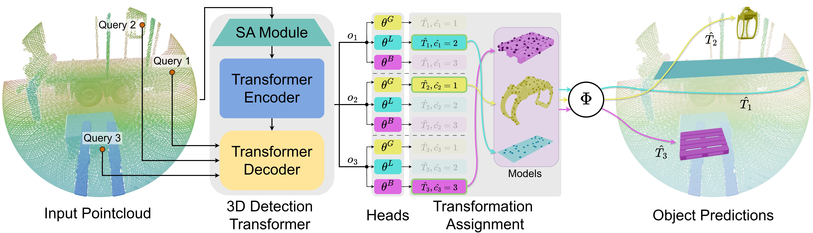
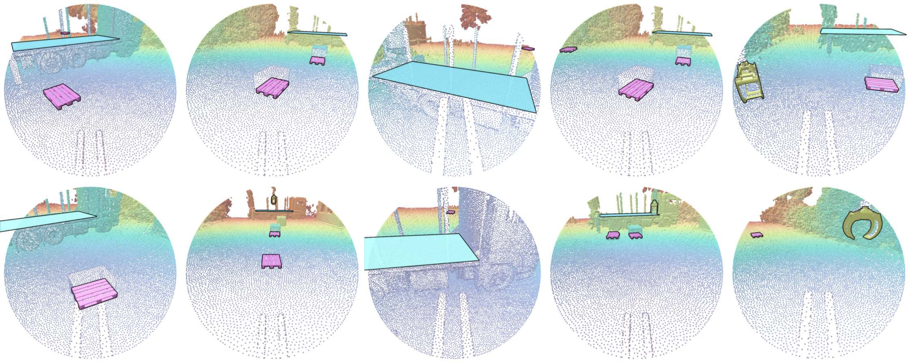

[![Contributors][contributors-shield]][contributors-url]
[](https://github.com/MichaelSchwingshackl)
[](https://github.com/fafraob)&nbsp;&nbsp;&nbsp;
[![Forks][forks-shield]][forks-url]
[![Stargazers][stars-shield]][stars-url]
[![Issues][issues-shield]][issues-url]

[contributors-shield]: https://img.shields.io/github/contributors/MichaelSchwingshackl/piratr.svg?style=for-the-badge&height=40&color=D436C2
[contributors-url]: https://github.com/MichaelSchwingshackl/piratr/graphs/contributors
[forks-shield]: https://img.shields.io/github/forks/MichaelSchwingshackl/piratr.svg?style=for-the-badge&height=40&color=36C2D4
[forks-url]: https://github.com/MichaelSchwingshackl/piratr/network/members
[stars-shield]: https://img.shields.io/github/stars/MichaelSchwingshackl/piratr.svg?style=for-the-badge&height=40&color=36C2D4
[stars-url]: https://github.com/MichaelSchwingshackl/piratr/stargazers
[issues-shield]: https://img.shields.io/github/issues/MichaelSchwingshackl/piratr.svg?style=for-the-badge&height=40&color=C2D436
[issues-url]: https://github.com/MichaelSchwingshackl/piratr/issues
[license-shield]: https://img.shields.io/github/license/MichaelSchwingshackl/piratr.svg?style=for-the-badge&height=40
[license-url]: https://github.com/MichaelSchwingshackl/piratr/blob/master/LICENSE.txt


<div align="center">
<h1> 
PIRATR: <span style="color:#D436C2">P</span>arametric Object <span style="color:#36C2D4">I</span>nference for <span style="color:#C2D436">R</span>obotic <span style="color:#D436C2">A</span>pplications with <span style="color:#36C2D4">Tr</span>ansformers in 3D Point Clouds</h1>

<h3>Accepted at 2026 IEEE International Conference on Robotics & Automation (ICRA) 🇦🇹</h3>

[**Michael Schwingshackl**](https://scholar.google.com/citations?user=fsvMYQYAAAAJ&hl=de&oi=ao)<sup>&ast;</sup>,
[**Fabio F. Oberweger**](https://scholar.google.com/citations?user=njm6I3wAAAAJ&hl=de&oi=ao)<sup>&ast;</sup>,<br>
[**Mario Niedermeyer**](https://publications.ait.ac.at/de/persons/mario.niedermeyer/),
[**Huemer Johannes**](https://publications.ait.ac.at/de/persons/johannes.huemer) &
[**Markus Murschitz**](https://scholar.google.com/citations?user=S8yQbTQAAAAJ&hl=de&oi=sra)

AIT Austrian Institute of Technology<br>
Center for Vision, Automation & Control

&ast;co-first authors &emsp;

<a href="https://arxiv.org/pdf/2509.03262"></a>
<a href='https://fafraob.github.io/pi3detr/'></a>
</div>

We present **PIRATR**, an end-to-end 3D object detection framework for robotic use cases in point clouds. Extending [PI3DETR](https://github.com/fafraob/pi3detr.git), our method streamlines parametric 3D object detection by jointly estimating multi-class 6-DoF poses and class-specific parametric attributes directly from occlusion-affected point cloud data. This formulation enables not only geometric localization but also the estimation of task-relevant properties for parametric objects, such as a gripper’s opening, where the 3D model is adjusted according to simple, predefined rules. The architecture employs modular, class-specific heads, making it straightforward to extend to novel object types without re-designing the pipeline. We validate PIRATR on an automated forklift platform, focusing on three structurally and functionally diverse categories: crane grippers, loading platforms, and pallets. Trained entirely in a synthetic environment, PIRATR generalizes effectively to real outdoor LiDAR scans, achieving a detection mAP of 0.919 without additional fine-tuning. PIRATR establishes a new paradigm of pose-aware, parameterized perception. This bridges the gap between low-level geometric reasoning and actionable world models, paving the way for scalable, simulation-trained perception systems that can be deployed in dynamic robotic environments. 



## Installation
Our code is tested with PyTorch 2.5.1, CUDA 12.1 and Python 3.11.10. It may and probably will work with other versions too.

You will simply need to install the required dependencies using pip in your preferred python environment (e.g. venv or conda), e.g.:

```bash
pip install -r requirements.txt
```
We also provide a [Dockerfile](Dockerfile) if a containerized environment is preferred.

## Running PITRATR
This repository contains a pre-trained [checkpoint](ckpts/piratr.ckpt) (don't forget about git lfs) of PIRATR and scripts for inference, training, and evaluation. Moreover, we provide a small set of [demo samples](demo_samples) (point clouds and meta information) to test the code.

### Inference
To run and visualize the demo samples, use
```bash
python predict_piratr.py \
    --config configs/piratr.yaml \
    --checkpoint ckpts/piratr.ckpt \
    --path demo_samples \
    --sample_mode fps
```
Given the checkpoint (`--checkpoint`) and the config file (`--config`), the script runs inference on the input file or folder specified by `--path`. Supported point cloud file formats include .ply, .obj, .pt, and .xyz but the script can also handle folders containing multiple point cloud files.

When dealing with huge point clouds, you may want to adjust the sampling parameters to reduce memory usage and improve inference speed. For example, you can use the `--samples` argument to limit the number of points processed, and the `--reduction` argument to downsample the point cloud with random sampling before applying the main sampling strategy.
```bash
python predict_piratr.py \
    --config configs/piratr.yaml \
    --checkpoint ckpts/piratr.ckpt \
    --path path_to_your_huge_pc \
    --samples 32768 \
    --sample_mode fps \
    --reduction 100000
```
In this case, the point cloud will be reduced to 100,000 points with random sampling before applying the farthest point sampling strategy to obtain the final 32,768 points.

If you want to change the number of queries used during inference, which is possible since we do use non-parametric queries, you can adjust `num_preds` in the config file.

### Train
To train the model, use the following command:
```bash
python train.py --config configs/piratr.yaml
```
The `--config` file specifies all the hyperparameters and settings for training the model. You can adjust it to match your dataset and experiment requirements. With `data_root`, `data_val_root` and `data_test_root` you can specify the paths to your training, validation and test datasets, respectively. With the current config, you can test the training on the provided demo samples, which are a subset of the full dataset. It will continue the training on the provided checkpoint. Together with the point clouds, you can find the meta information about the samples, which is used for training and evaluation, in `demo_samples`. Checkout [dataset.py](piratr/dataset/datasets.py) for more details on the dataset structure and how to create your own dataset.

## Examples

Qualitative synthetic-to-real prediction of PIRATR, which is trained solely on synthetic data and evaluated on real scans. Predicted classes: <span style="color:#C2D436">**gripper**</span>, <span style="color:#36C2D4">**loading platforms**</span>, and <span style="color:#D436C2">**pallets**</span>.

## Evaluation
To compute the evaluation metrics presented in the paper, use the following command:

```bash
python3 evaluate_piratr.py --config configs/piratr.yaml --checkpoint ckpts/piratr.ckpt --path demo_samples/
```
For the current config, this will provide the evaluation metrics on the provided demo samples, which are a subset of the full dataset. You can adjust the `data_test_root` in the config file to evaluate on another test dataset.

## Citation
<span style="color:#36C2D4">**TODO: Update**</span>
```bibtex
@misc{2025pi3detr,
      title={PI3DETR: Parametric Instance Detection of 3D Point Cloud Edges with a Geometry-Aware 3DETR}, 
      author={Fabio F. Oberweger and Michael Schwingshackl and Vanessa Staderini},
      year={2025},
      eprint={2509.03262},
      archivePrefix={arXiv},
      primaryClass={cs.CV},
      url={https://arxiv.org/abs/2509.03262}, 
}

```
